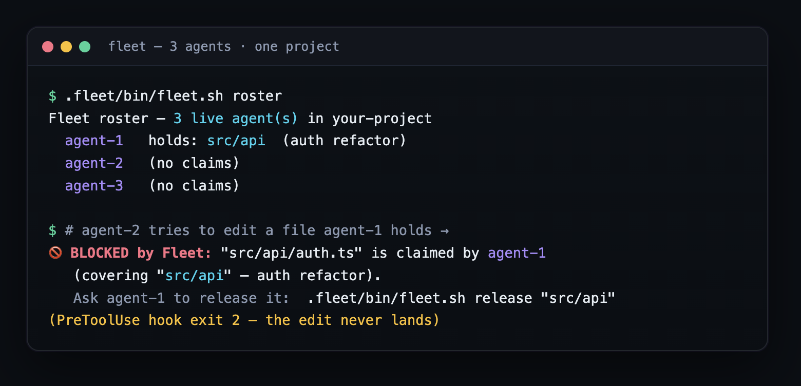

<div align="center">

# 🛰 Fleet

### Parallel-agent compatibility for Claude Code

Open **many Claude Code windows on one project** and have each work independently
but collaboratively. A small committed `.fleet/` folder turns every window into a
self-registering agent — and edits to a file another *live* agent has claimed are
**hard-blocked** by the harness, so windows never silently clobber each other.

[](https://github.com/convenientlymike/fleet/actions/workflows/ci.yml)
&nbsp;
&nbsp;
&nbsp;
&nbsp;
&nbsp;

</div>

<div align="center">



</div>

---

## Why

Open a second Claude Code window on the same repo and the two will happily edit the
same file seconds apart — silently overwriting each other's work.

> Fleet makes that **impossible**: a claimed file is denied at the `PreToolUse` hook
> with `exit 2` — a real block, not a warning — with **no daemon, no server, no ports**.

## ✨ Features

### 🛡 Collision-proof by construction
- **Hard block, not a warning** — editing a file a live foreign agent claimed returns `exit 2`; the edit never lands.
- **Atomic claims** — a claim is an atomic `mkdir` of a lock dir (the one POSIX op that's both atomic and fail-if-exists), so two windows opening in the same second can't both win.
- **Self-healing** — dead windows are reaped by heartbeat timeout (`stale_after_s`, default **180 s**); nothing stays locked forever.

### 🤝 Coordination, automatically
- **Self-registering agents** — each window becomes `agent-N` on `SessionStart`, silently coexisting with your other hooks.
- **Live roster in context** — every turn injects who's live and what they hold, so the model claims before editing on its own.
- **Agent-to-agent messaging** — `msg` / `inbox` to negotiate handoffs between windows.

### 🧰 Zero infrastructure
- **Just files + 4 hooks** — no daemon, no server, no ports, no dependencies beyond Bash + Claude Code.
- **Drop-in** — `bash install.sh /path/to/project` copies `.fleet/` and wires the hooks.

### 🌳 Two isolation modes
- **Shared tree (default)** — all windows edit one working copy; claims + the guard prevent same-file collisions.
- **Worktree mode** — each window gets its own git worktree (true file isolation) with Fleet coordinating intent across them.

### 🚦 Push-safe under parallelism
- **A sibling window's uncommitted work can't false-red your push.** A pre-push gate that lints/tests the whole repo
  reads the *filesystem* — i.e. **every** live window's uncommitted work at once — so one window's mid-build files
  (an untested new component, a half-edited config) could block another window's push even when its **commit** was
  perfectly green. `.fleet/bin/isolated-gate.sh` fixes it: when the shared tree is dirty, it validates the pushed
  **commit** in a clean ephemeral git worktree (with the project's heavy deps symlinked in) — bypassing the sibling's
  work, never touching the primary tree or stashing anyone's changes. Clean tree → runs in place (fast path).
- **One line to adopt** — wrap your existing gate in your pre-push hook: `exec .fleet/bin/isolated-gate.sh -- bash <your gate>`.

## 📸 A look inside

The hero above is a **real** session — three live agents, and a claimed file
hard-blocking a foreign edit. A couple more, straight from the CLI:

**`doctor` — health, config, and hook wiring at a glance**
```console
$ .fleet/bin/fleet.sh doctor
== fleet doctor ==
Fleet v0.1.0  (schema 1)
config:      claim_mode=prefix  block_mode=block  stale_after_s=180  state_location=local
live agents: 3    active claims: 1
tools:       jq ✓   python3 ✓   git ✓
hooks:       wired in .claude/settings.json (OK)
scripts:     all executable (OK)
stale agent files (will be reaped): 0
```

**Worktree mode — true file isolation per window**
```console
$ .fleet/bin/fleet.sh worktree enable
$ .fleet/bin/fleet.sh worktree new checkout-ui   # this window gets its own git worktree
```

## 🚀 Quickstart

| Prerequisite | Notes |
|---|---|
| Claude Code | the windows you open become agents |
| Bash + `git` | POSIX shell; `git` only for worktree mode |

```bash
# drop Fleet into any existing project
bash install.sh /path/to/your/project      # copies .fleet/ + wires the hooks
# …or, after copying .fleet/ in yourself:
bash .fleet/bin/fleet.sh init
```

Then **reopen** your project windows (hooks load at startup) and open as many as you
like — each is now a coordinating agent.

```bash
.fleet/bin/fleet.sh roster                 # who's live, what they hold
.fleet/bin/fleet.sh claim src/api "auth"   # reserve an area before editing
.fleet/bin/fleet.sh release src/api        # done
.fleet/bin/fleet.sh msg agent-1 "ping"     # message another window
.fleet/bin/fleet.sh inbox                  # read messages
.fleet/bin/fleet.sh worktree enable        # opt into per-window git worktrees
```

## 🏗 Architecture

Four Claude Code hooks over a plain-file state dir — no process to run:

```
  Claude window ─┐
   (SessionStart)│   register.sh ──▶ ┌───────────────────────────┐
   (UserPrompt)  │   awareness.sh ──▶│   .fleet/state/  (gitignored)
   (PreToolUse)  │   guard.sh ──────▶│   ├── agents/<id>.json  (roster + ♥ heartbeat)
   (SessionEnd)  │   deregister.sh ─▶│   ├── claims/<path>/    (atomic mkdir locks)
                 │                   │   ├── board.jsonl       (intent log)
   edit blocked ◀┘   exit 2   ◀──────│   └── inbox/<agent>/    (messages)
                                     └───────────────────────────┘
```

- **`register.sh`** (`SessionStart`) — registers the window as `agent-N`, silently.
- **`guard.sh`** (`PreToolUse(Edit|Write|…)`) — denies edits to files a live foreign agent claimed (`exit 2`).
- **`awareness.sh`** (`UserPromptSubmit`) — heartbeat + injects the live roster each turn.
- **`deregister.sh`** (`SessionEnd`) — releases this agent's claims, drops it from the roster.

Full config, recovery, and caveats (notably: avoid iCloud/Dropbox-synced folders):
[.fleet/README.md](.fleet/README.md).

## 📂 Project layout

```
install.sh              # one-shot installer (copies .fleet/ + wires hooks into a target repo)
.fleet/
  bin/fleet.sh          # the CLI (roster · claim · release · msg · inbox · board · worktree · doctor)
  bin/{register,guard,awareness,deregister}.sh   # the four hook handlers
  bin/lib.sh            # shared helpers (atomic claim, heartbeat, JSONL)
  config.json           # stale_after_s · claim_mode · block_mode · state_location
  state/                # runtime coordination state (gitignored — per machine)
.claude/settings.json   # registers the four hooks
CLAUDE.md               # the Fleet protocol stanza injected into each agent
```

## 🔒 Security

No secrets, no network, no ports — Fleet is plain local files + shell hooks. Runtime
state (`.fleet/state/`) is gitignored (per-machine). Report issues: [SECURITY.md](SECURITY.md).

## License

[MIT](LICENSE) © 2026 convenientlymike

<div align="center"><sub><em>Many windows, one project — no clobbering.</em></sub></div>
